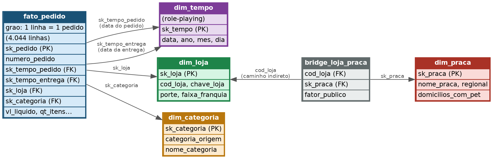

# Pata Amiga — Modelo Dimensional de Pedidos e Entregas

Mini-Projeto Avaliativo · Módulo 2 · Semana 7

## Sumário

1. [Contextualização](#1-contextualização)
2. [O desafio](#2-o-desafio)
3. [Diagnóstico da origem](#3-diagnóstico-da-origem)
4. [Decisões de tratamento](#4-decisões-de-tratamento)
5. [Modelo dimensional](#5-modelo-dimensional)
6. [Como reproduzir o banco do zero](#6-como-reproduzir-o-banco-do-zero)
7. [As cinco respostas de negócio](#7-as-cinco-respostas-de-negócio)
8. [O que os dados não permitem afirmar](#8-o-que-os-dados-não-permitem-afirmar)
9. [Vídeo](#9-vídeo)

## 1. Contextualização

A Pata Amiga é uma rede catarinense de pet shops com 32 lojas. Desde setembro de
2023 a operação de pedidos roda em app, site, telefone, WhatsApp e loja física.
Em sete meses foram 4.044 pedidos, registrados em três sistemas que não
conversam entre si: a plataforma de e-commerce, o cadastro de lojas da
franquia e a planilha de praças de atendimento. Este projeto organiza esses
dados em um modelo dimensional para responder cinco perguntas de negócio da
diretoria.

## 2. O desafio

Construir a área de staging → dimensões → fato em PostgreSQL a partir de três
tabelas de origem não tratadas, e responder cinco perguntas de negócio que
hoje não são respondíveis por causa da qualidade e da falta de integração dos
dados.

## 3. Diagnóstico da origem

Foram recebidas três tabelas na área de staging (`stg_pedido`, `stg_loja`,
`stg_loja_praca`), todas com colunas em texto (VARCHAR), sem `UPDATE` ou
`ALTER` permitidos — todo o tratamento acontece na carga das dimensões e da
fato.

**stg_pedido (4.044 linhas)** — é a tabela com mais problemas:
- O nome da loja (`Loja-Nome`) aparece em **128 grafias diferentes** para as
  mesmas 32 lojas: com acento, sem acento, em caixa alta, com erro de
  digitação e com "/SC" sobrando no fim.
- A categoria de produto (`CategoriaProduto`) aparece em **37 grafias**
  diferentes para o que deveriam ser só 7 categorias padronizadas (ex:
  "Racao", "RACAO", "Ração" contam como três grafias distintas).
- **1.575 pedidos (~39%)** vieram sem `Cod Loja` preenchido — a loja só pode
  ser identificada pelo nome nesses casos.
- **3 pedidos** vieram sem `Loja-Nome` também, ou seja, sem nenhuma forma de
  identificar a loja.
- O campo de desconto (`HouveDesconto`) tem **17 grafias** diferentes para
  indicar sim/não (`S`, `SIM`, `1`, `X`, `TRUE`, `V`, etc.).
- O canal do pedido (`CanalPedido`) tem **20 grafias** diferentes, incluindo
  o caso de "WhatsApp" conter a substring "App" — o que exige cuidado na
  ordem de verificação.
- A data do pedido (`DtHoraPedido`) vem em formato americano
  (`MM/DD/YYYY HH12:MI AM`), enquanto os quatro marcos do processo de entrega
  vêm em formato ISO (`AAAAMMDD`) — dois formatos de data convivendo na
  mesma tabela.
- Os quatro marcos de processo (Separação, Nota Fiscal, Despacho, Entrega)
  têm, respectivamente, **1.077 / 1.338 / 1.665 / 1.953** registros em
  branco — o que não é erro, e sim processo ainda em aberto (pedido não
  chegou àquela etapa até o fim da janela de dados).
- Valores em reais (`ValorLiquidoPedido(R$)`) convivem em formatos
  inconsistentes: `"R$ 1.850,00"`, `"1850.00"`, `"1.200"`, `"-"` e vazio na
  mesma coluna.

**stg_loja (32 linhas)** — cadastro mais limpo, mas com:
- Nomes de loja em grafias variadas (acento, caixa, abreviação), que
  precisam ser padronizados antes de servirem de chave de cruzamento.
- A `FaixaFranquia` é uma "foto do presente": reflete a classificação atual
  da loja, não a que valia na data de cada pedido histórico — uma limitação
  que impacta a pergunta 5.

**stg_loja_praca (48 linhas)** — tabela ponte loja × praça de atendimento:
- Uma mesma loja pode atender mais de uma praça, com um percentual de
  público (`PercentualPublico`) que precisa somar 1,00 por loja.
- O campo `DomiciliosComPet` vem com ponto de milhar (ex: `"148.000"`
  significa 148 mil, não 148 vírgula zero).

### Resumo dos números

| Item | Contagem |
|---|---|
| Grafias distintas de nome de loja | 128 |
| Grafias distintas de categoria | 37 |
| Grafias distintas de CanalPedido | 20 |
| Grafias distintas de HouveDesconto | 17 |
| Pedidos sem `Cod Loja` preenchido | 1.575 (~39%) |
| Pedidos sem `Loja-Nome` preenchido | 3 |
| Marcos em branco — Separação | 1.077 |
| Marcos em branco — Nota Fiscal | 1.338 |
| Marcos em branco — Despacho | 1.665 |
| Marcos em branco — Entrega | 1.953 |

## 4. Decisões de tratamento

- **Máscara de data**: a data do pedido usa o formato americano
  (`MM/DD/YYYY HH12:MI AM`, via `TO_TIMESTAMP`), enquanto os quatro marcos do
  processo de entrega já vêm em ISO (`YYYY-MM-DD`), então usam só `::date`.
  Usar a máscara brasileira na data do pedido causa erro do PostgreSQL nas
  datas com mês maior que 12.
- **Regra dos números**: valores vazios ou `'-'` sempre viram `NULL`, nunca
  `0` — inclusive nos quatro intervalos de dias, para não fazer parecer que
  uma etapa não cumprida "aconteceu em zero dias".
- **De-para de categoria**: a ordem do `CASE` importa — `MED` é testado
  antes de `RA`, senão "Ração Medicamentosa" cairia em "Ração" ao invés de
  "Medicamento". Todo o teste é feito sem acento (via `TRANSLATE`) e em
  caixa alta, para não depender da grafia exata de origem.
- **De-para de canal**: mesma lógica — `WHATS` é testado antes de `APP`,
  senão os pedidos de WhatsApp cairiam dentro de "App" (já que a palavra
  "App" está contida em "WhatsApp").
- **Padronização do nome da loja**: primeiro um `REPLACE` remove o sufixo
  "/SC" e espaços duplos; depois normalizo acento e caixa com
  `UPPER(TRANSLATE(...))`. Restam 3 grafias que exigem tratamento manual via
  `CASE` (não resolvidas por regra geral): um erro de digitação
  ("Blumenal" → "Blumenau"), um apelido ("Floripa" → "Florianópolis") e uma
  abreviação ("Jgua do Sul" → "Jaraguá do Sul").
  - **Correção técnica importante**: a lista de caracteres do `TRANSLATE`
    precisa cobrir tanto acentos maiúsculos quanto minúsculos
    (`ÁÀÂÃÉÊÍÓÔÕÚÜÇáàâãéêíóôõúüç`). Usar só as maiúsculas causava falha
    silenciosa: nomes de cidade com acento em minúscula (ex:
    "Florianópolis") não eram normalizados corretamente por dependerem de
    `UPPER()` fazer o *case-folding* de caracteres acentuados — o que nem
    sempre acontece dependendo da configuração de locale do banco. Esse bug
    fazia 264 pedidos caírem incorretamente na loja "Não Informado" em vez
    de apenas 3 (o valor correto, conferido no `00-conferencia.sql`).
- **Loja pelo Cod Loja OU pelo nome**: como 39% dos pedidos não têm
  `Cod Loja` preenchido, a fato tenta primeiro o `Cod Loja` (chave exata) e,
  se não achar, cai para o nome padronizado. Se nenhum dos dois resolver,
  vai para a linha -1.
- **Categoria pela grafia crua**: a `dim_categoria` guarda a grafia
  original em `categoria_origem`; a fato encontra a linha com um JOIN de
  uma coluna só, sem precisar reaplicar o CASE de classificação.
- **Toda dimensão tem a linha -1** ("Não Informado"), inserida antes do
  `INSERT ... SELECT`, para nenhuma FK da fato ficar nula.

## 5. Modelo dimensional



O modelo segue o esquema estrela: `fato_pedido` no grão de uma linha por
pedido (4.044 linhas), ligado a 4 dimensões. A `dim_tempo` é usada duas
vezes (role-playing dimension): uma para a data do pedido, outra para a
data da entrega. A `dim_praca` não se liga direto à fato — o caminho é
indireto, através da `bridge_loja_praca`, já que uma loja pode atender mais
de uma praça (relação N:N) com um fator de rateio.

## 6. Como reproduzir o banco do zero

Conectado como `postgres`, rode os scripts na ordem:

```bash
psql -U postgres -d postgres -f sql/01-carga-staging.sql
psql -U postgres -d dw_pata_amiga -f sql/02-dimensoes-prontas.sql
psql -U postgres -d dw_pata_amiga -f sql/03-dimensoes.sql
psql -U postgres -d dw_pata_amiga -f sql/04-fato.sql
```

No pgAdmin: crie o banco `dw_pata_amiga` primeiro, depois rode cada arquivo
numa Query Tool conectada a ele (sem as linhas `DROP DATABASE`,
`CREATE DATABASE` e `\c`, que são comandos exclusivos do terminal `psql`).

## 7. As cinco respostas de negócio

**P1 — Onde está o gargalo da entrega?**

| Porte | Integração→Separação | Separação→Nota | Nota→Despacho | Despacho→Entrega | Total até entrega |
|---|---|---|---|---|---|
| Grande | 2,0 dias | 0,6 dias | 3,3 dias | 2,0 dias | 7,9 dias |
| Média | 2,0 dias | 0,6 dias | 3,3 dias | 2,0 dias | 8,0 dias |
| Pequena | 3,0 dias | 0,7 dias | **8,5 dias** | 2,9 dias | **15,2 dias** |
| Rede (geral) | 2,1 dias | 0,6 dias | 4,1 dias | 2,1 dias | 9,0 dias |

O gargalo **não é o mesmo em todos os portes**. Nas lojas Grandes e Médias, a
etapa mais lenta é Nota→Despacho (~3,3 dias), mas dentro de um total
saudável (~8 dias). Nas lojas Pequenas, essa mesma etapa quase triplica
(8,5 dias), levando o processo inteiro a durar quase o dobro do resto da
rede (15,2 dias). O gargalo da rede está concentrado nas lojas Pequenas, na
etapa entre a nota fiscal e o despacho para a transportadora.

**P2 — Qual categoria concentra o faturamento?**

| Categoria | % do faturamento |
|---|---|
| Ração | 60,01% |
| Medicamento | 17,06% |
| Petisco | 7,17% |
| Serviço | 5,24% |
| Higiene | 5,15% |
| Acessório | 3,61% |
| Brinquedo | 1,76% |

Ração sozinha responde por 60% de tudo que a rede fatura — a categoria
campeã é a mesma em qualquer porte de loja, já que é o item de reposição
recorrente do negócio.

**P3 — O desconto funciona igual em todo canal?**

| Canal | Ticket médio COM desconto | Ticket médio SEM desconto | % do faturamento |
|---|---|---|---|
| App | R$ 488,04 | R$ 170,48 | 30,79% |
| Loja Física | R$ 494,04 | R$ 196,78 | 20,11% |
| Site | R$ 501,92 | R$ 189,48 | 25,13% |
| Telefone | R$ 514,02 | R$ 195,46 | 6,88% |
| WhatsApp | R$ 514,33 | R$ 173,88 | 10,52% |

Não é a mesma política em todo canal, mas o padrão se repete: em **todos**
os canais o ticket médio com desconto é de 2,5 a quase 3 vezes maior que
sem desconto. Isso sugere que o desconto está associado a compras maiores
(reposição em volume), não a promoções pontuais de baixo valor — o efeito é
consistente, mas a magnitude do ticket varia por canal (App tem o menor
ticket sem desconto, R$170,48).

**P4 — Qual praça de atendimento concentra o faturamento?**

| Praça | % do faturamento |
|---|---|
| Vale do Itajaí | 35,34% |
| Grande Florianópolis | 15,81% |
| Norte Industrial | 9,78% |
| Litoral Sul | 7,64% |
| Litoral Norte | 7,19% |
| Extremo Oeste | 5,48% |
| Carbonífera | 4,95% |
| Serra Catarinense | 4,49% |
| Meio-Oeste | 3,29% |
| Foz do Itajaí | 2,61% |
| Planalto Norte | 1,73% |
| Planalto Serrano | 1,64% |

O Vale do Itajaí concentra sozinho mais de um terço do faturamento da rede,
seguido de longe pela Grande Florianópolis.

**P5 — Onde abrir a próxima loja, e o que os dados não permitem afirmar?**

As lojas com mais itens vendidos por mil habitantes são todas de porte
**Pequena** (Rio dos Cedros, Presidente Getúlio, Ibirama...), o que indica
mercados menores mas proporcionalmente bem atendidos. Só que essas mesmas
lojas têm o pior tempo médio de entrega da rede (14 a 16 dias, contra ~8
dias nas médias/grandes) — o mesmo gargalo identificado na P1.

Por faixa de franquia (foto atual): Ouro concentra 56,39% do faturamento,
Diamante 21,31%, Prata 17,55%, Bronze 4,69%.

**Recomendação**: antes de abrir uma loja nova, o dado sugere resolver o
gargalo logístico das lojas Pequenas — elas já têm demanda proporcional
alta, mas a operação não escala bem nesse porte. Abrir mais uma loja Pequena
sem corrigir a etapa Nota→Despacho tende a reproduzir o mesmo problema.

## 8. O que os dados não permitem afirmar

- **Faixa de franquia histórica**: o cadastro de lojas guarda só a
  classificação (Bronze/Prata/Ouro/Diamante) **atual**, não a que a loja
  tinha na data de cada pedido. Por isso a P5 não responde "quanto do
  faturamento veio de lojas que já eram Ouro na época do pedido" — o
  passado foi sobrescrito pelo cadastro de hoje.
- **3 pedidos** não têm loja identificada (nem código, nem nome) e caem na
  linha "Não Informado" — não entram em nenhuma métrica por loja/praça.
- **1.953 pedidos** (quase metade) ainda não tiveram entrega concluída
  dentro da janela de dados — o tempo médio de entrega (P1) é calculado só
  sobre quem já foi entregue, o que pode subestimar o tempo real se os
  pedidos mais lentos forem justamente os que ainda não fecharam.
- **257 pedidos** sem quantidade de itens e **121** sem valor líquido
  registrado ficaram como NULL e não entram nas somas de faturamento nem de
  itens vendidos.